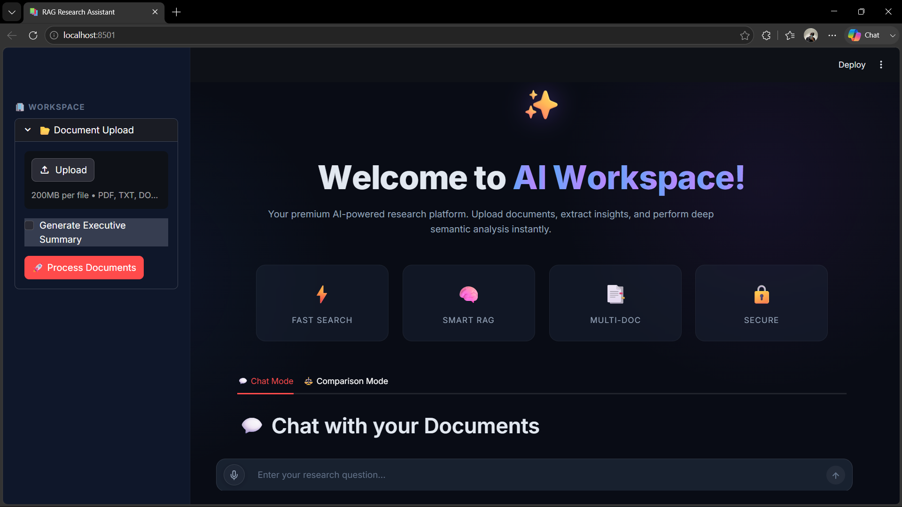
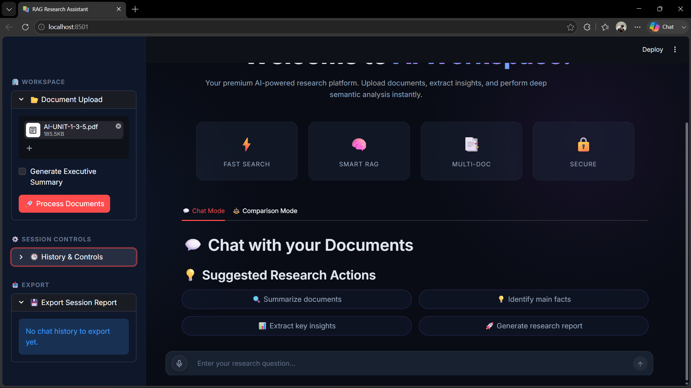
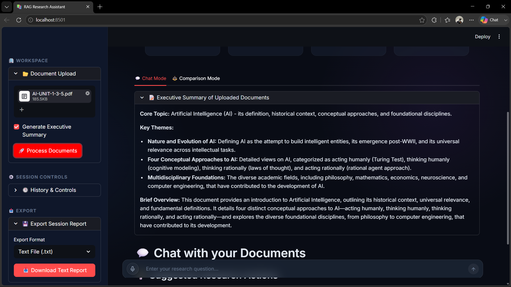
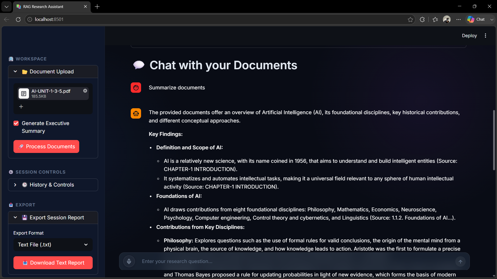
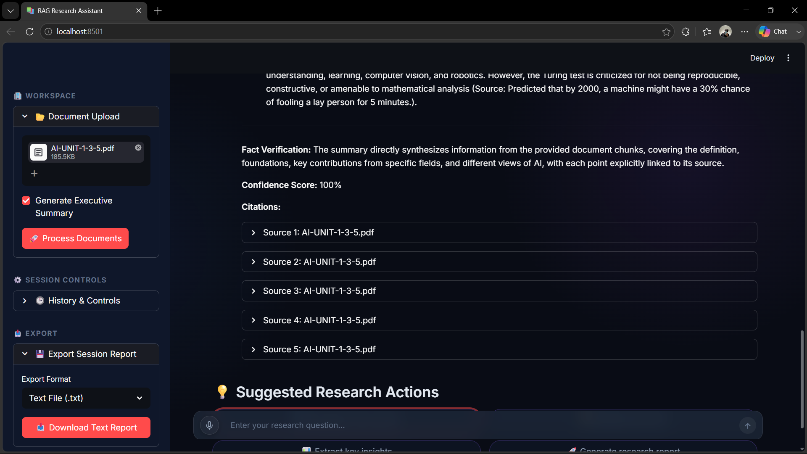
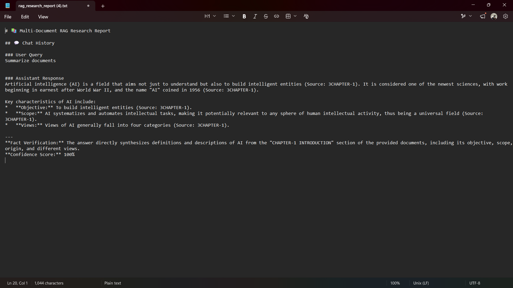
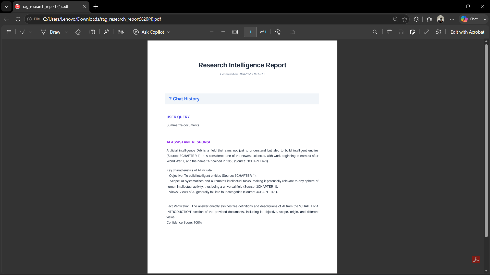

# 📚 Multi-Document RAG Research Assistant

<p align="center">
  
  
  
  
  
</p>

A production-ready **Retrieval-Augmented Generation (RAG)** application that allows users to upload multiple documents, ask natural language questions, generate AI-powered summaries, compare documents, and create research reports using **Google Gemini**, **LangChain**, and **ChromaDB**.

---

## 🚀 Features

- 📄 Upload multiple PDF, DOCX, and TXT documents
- 🤖 AI-powered Question Answering
- 🔍 Hybrid Search
  - Semantic Search (Embeddings)
  - BM25 Keyword Search
  - Ensemble Retrieval
- 🎯 Cross-Encoder Re-ranking for improved retrieval accuracy
- 📑 Automatic Document Summarization
- 📊 Multi-Document Comparison
- 📝 AI Research Report Generator
- 🎙️ Voice Input Support
- 💬 Chat History
- 📥 Export Research Reports as PDF
- ⚡ Fast Vector Search with ChromaDB
- 🎨 Modern Streamlit Interface

---

# 🏗️ System Architecture

```text
                Upload Documents
                      │
                      ▼
          Document Validation
                      │
                      ▼
          Document Loader
                      │
                      ▼
          Text Chunking
                      │
                      ▼
      HuggingFace Embeddings
                      │
                      ▼
              Chroma Vector DB
                      │
        ┌─────────────┴─────────────┐
        ▼                           ▼
 BM25 Retriever          Semantic Retriever
        │                           │
        └─────────────┬─────────────┘
                      ▼
            Ensemble Retriever
                      ▼
        Cross Encoder Re-ranking
                      ▼
              Google Gemini
                      ▼
        Answer / Summary / Report
```

---

# 🛠️ Tech Stack

## Frontend

- Streamlit

## Backend

- Python

## AI / LLM

- Google Gemini 2.5 Flash
- LangChain

## Embedding Model

- all-MiniLM-L6-v2

## Vector Database

- ChromaDB

## Retrieval

- Semantic Search
- BM25
- Ensemble Retrieval
- Cross-Encoder Re-ranking

## Libraries

- Sentence Transformers
- Transformers
- PyPDF
- python-docx
- FPDF
- dotenv

---

# 📂 Project Structure

```text
Multi-Document-RAG-Research-Assistant/
│
├── app.py
├── config.py
├── requirements.txt
├── README.md
│
├── utils/
│   ├── chunker.py
│   ├── comparer.py
│   ├── document_loader.py
│   ├── embedder.py
│   ├── retriever.py
│   ├── summarizer.py
│   ├── validator.py
│   ├── stt.py
│   └── voice_component.py
│
├── assets/
├── uploads/
├── chroma_db/
└── PROJECT_REPORT.md
```

---

# ⚙️ Installation

Clone the repository

```bash
git clone https://github.com/fazal-shaikh/Multi-Document-RAG-Research-Assistant.git

cd Multi-Document-RAG-Research-Assistant
```

Create a virtual environment

```bash
python -m venv venv
```

Activate it

### Windows

```bash
venv\Scripts\activate
```

### Linux / macOS

```bash
source venv/bin/activate
```

Install dependencies

```bash
pip install -r requirements.txt
```

---

# 🔑 Environment Variables

Create a `.env` file in the project root.

```env
GOOGLE_API_KEY=YOUR_GOOGLE_API_KEY
```

---

# ▶️ Run the Application

```bash
streamlit run app.py
```

---

# 📌 Workflow

1. Upload one or more documents
2. Documents are validated
3. Text is extracted
4. Documents are chunked
5. Embeddings are generated
6. ChromaDB stores the vectors
7. Hybrid retrieval fetches relevant chunks
8. Cross-Encoder re-ranks the results
9. Google Gemini generates the final response
10. Export summaries and reports

---

# 🎯 Use Cases

- Academic Research
- Legal Document Analysis
- Business Reports
- Technical Documentation
- Research Paper Exploration
- Company Policy Search
- Knowledge Base Assistant

---

## 📸 Screenshots























---

# 🔮 Future Improvements

- User Authentication
- Cloud Deployment
- OCR Support
- Image Understanding
- Audio Document Support
- Multi-language Support
- Citation Highlighting
- Conversation Memory
- Dark / Light Theme

---

# 👨‍💻 Author

**Fazal M. Shaikh**

- 🎓 B.E. Computer Science & Engineering
- 💼 Gen AI & Data Science Engineer


# ⭐ Support

If you found this project useful, consider giving it a ⭐ on GitHub.

It helps others discover the project and supports future development.
